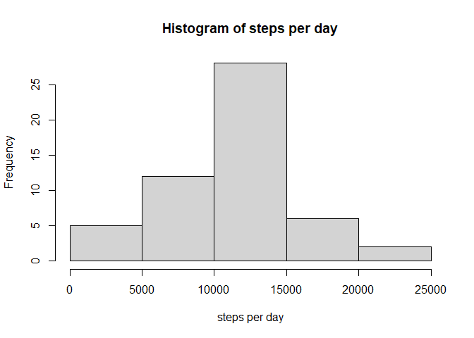
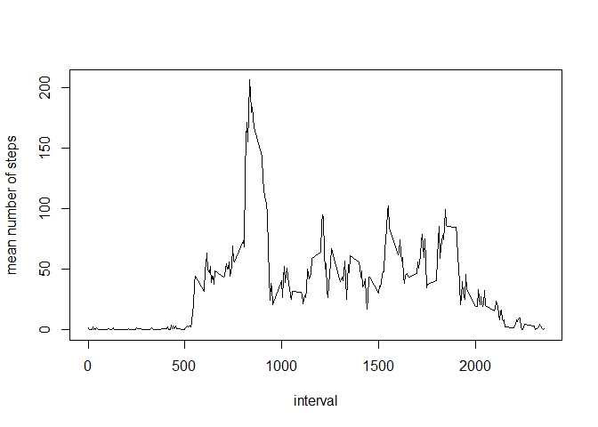
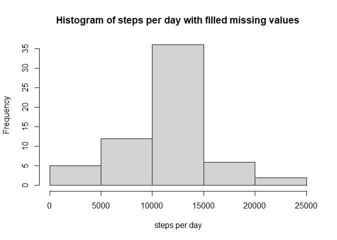

## Loading and preprocessing the data
We load the data using the readr package, which identifies the correct column classes. In particular, the dates are conveniently parsed as Date objects

```r
library(readr)
activity = read_csv("activity.zip")
```

```
## 
## -- Column specification --------------------------------------------------------
## cols(
##   steps = col_double(),
##   date = col_date(format = ""),
##   interval = col_double()
## )
```


## What is mean total number of steps taken per day?
Calculate the total number of steps per day

```r
library(dplyr, warn.conflicts = F)
steps_per_day = activity %>% 
  group_by(date) %>% 
  summarise(stepsPerDay = sum(steps))
```

```
## `summarise()` ungrouping output (override with `.groups` argument)
```
Plot histogram. The standard binning seems to give reasonable result.  
It can be seen that on a "normal" day, people seem to take between 10000 and 15000 steps a day.

```r
hist(steps_per_day$stepsPerDay,
     main = "Histogram of steps per day",
     xlab = "steps per day")
```

<!-- -->

The mean and median of the total number of steps taken per day are:

```r
mean(steps_per_day$stepsPerDay, na.rm = TRUE)
```

```
## [1] 10766.19
```

```r
median(steps_per_day$stepsPerDay, na.rm = TRUE)
```

```
## [1] 10765
```

## What is the average daily activity pattern?
Calcualate the average number of steps taken for each interval over all days.

```r
mean_steps_per_interval = activity %>% 
  group_by(interval) %>% 
  summarise(meanNumberOfSteps = mean(steps, na.rm = TRUE))
```

```
## `summarise()` ungrouping output (override with `.groups` argument)
```

```r
with(mean_steps_per_interval, plot(x = interval, y = meanNumberOfSteps, type = "l",
                                   ylab = "mean number of steps"))
```

<!-- -->

The interval in which, on average, the most steps are taken, is interval 835: 

```r
index = which.max(mean_steps_per_interval$meanNumberOfSteps)
mean_steps_per_interval$interval[index]
```

```
## [1] 835
```
## Imputing missing values
In total we have 2304 missing values. They are all in the `steps` column.

```r
colSums(is.na(activity))
```

```
##    steps     date interval 
##     2304        0        0
```
We replace missing values for a step with the mean number of steps for its interval and save it in a new dataframe.


```r
activity_nas_filled = activity %>% 
  group_by(interval) %>% 
  mutate(steps = ifelse(is.na(steps), mean(steps, na.rm = T), steps)) %>% 
  ungroup()
```

The distribution for the number of steps per day after imputing the missing values has an even more pronounced peak in the 10000-15000 bin. This makes some sense because we replaced missing values with the average amount of steps people take in this 5-minute interval. This makes more days end up in the "typical day" bin of 10000-15000 steps.

```r
steps_per_day_nas_filled = activity_nas_filled %>% 
  group_by(date) %>% 
  summarise(stepsPerDay = sum(steps))
```

```
## `summarise()` ungrouping output (override with `.groups` argument)
```

```r
hist(steps_per_day_nas_filled$stepsPerDay,
     main = "Histogram of steps per day with filled missing values",
     xlab = "steps per day")
```

<!-- -->

The mean and median of the total number of steps taken per day are for the _filled_ dataset are:

```r
mean(steps_per_day_nas_filled$stepsPerDay)
```

```
## [1] 10766.19
```

```r
median(steps_per_day_nas_filled$stepsPerDay)
```

```
## [1] 10766.19
```
Because for some days _all_ the step values are missing, these days end up with a non-integer total number of steps. In fact, their total number of steps is exactly the average daily number of steps. This is an artifact of our replacement strategy for missing values.

By design, our replacement strategy did not change the mean daily number of steps.

## Are there differences in activity patterns between weekdays and weekends?
Calculate a marker column whether a date falls on a weekday or on weekends.  
We use lubridate instead of weekdays because the latter returns language-dependent strings, while the former returns language-independent numbers.

```r
library(lubridate, warn.conflicts = F)
activity_nas_filled = activity_nas_filled %>% 
  mutate(weekday = wday(date, week_start = 1)) %>% 
  mutate(weekdayOrWeekend = ifelse(weekday <= 5, "weekday", "weekend")) %>% 
  mutate(weekdayOrWeekend = as.factor(weekdayOrWeekend))
```


Comparing weekends with weekdays, the most obvious difference is that during weekdays, the activity picks up earlier in the morning and peaks quite high, when everybody needs to get to the office. During weekends, people start to be active only later in the day.

```r
library(ggplot2, warn.conflicts = F)
activity_nas_filled %>% 
  group_by(interval, weekdayOrWeekend) %>% 
  summarise(steps = mean(steps)) %>% 
  ggplot(aes(x = interval, y = steps)) +
  geom_line() +
  facet_grid(rows = vars(weekdayOrWeekend)) +
  ylab("Number of steps") +
  xlab("Interval")
```

```
## `summarise()` regrouping output by 'interval' (override with `.groups` argument)
```

<!-- -->
